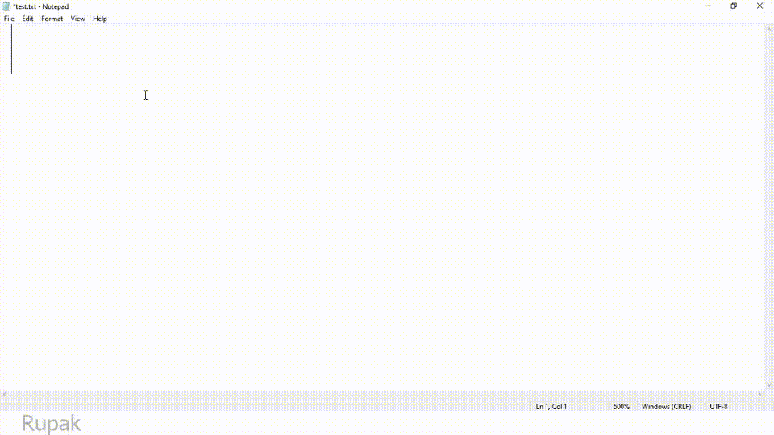

# Lipi
A Minimal Bangla keyboard

## Libreary used
* [pyavrophonetic](https://github.com/TrendBreaker/pyAvroPhonetic) for `english to bengali convertion` 
   * (_NB:_ <b>৳</b> changed to <b>₹</b> )
* [keyboard](https://github.com/boppreh/keyboard) for `taking control of the keyboard`
* [tkinter](https://wiki.python.org/moin/TkInter) for `gui stuffs`

### Inspired By 
* [Avro keyboard](https://www.omicronlab.com/avro-keyboard.html)

### Why this project?
* to check my skills
* I was challeged to make this keyboard.

## run (for Now)
```console
python Lipi.py
```


## To do List
1. <strike>Minimal Structure</strike> `15.04.2021`
2. Smart Backspace
3. Auto correct
4. Preview Window
5. Support for spellings of _West Bengal Bangla Academy_
6. Beta Testing
7. Make it  Installable
# Demo

